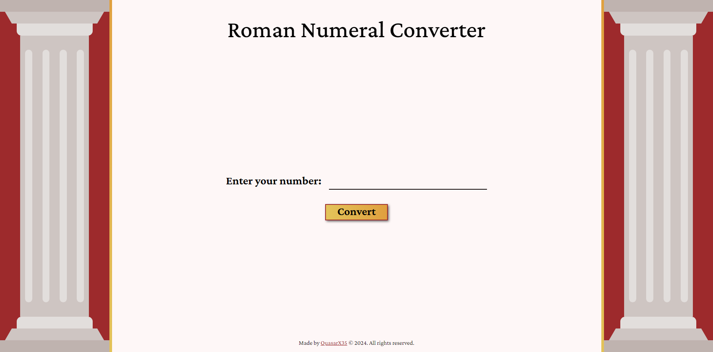
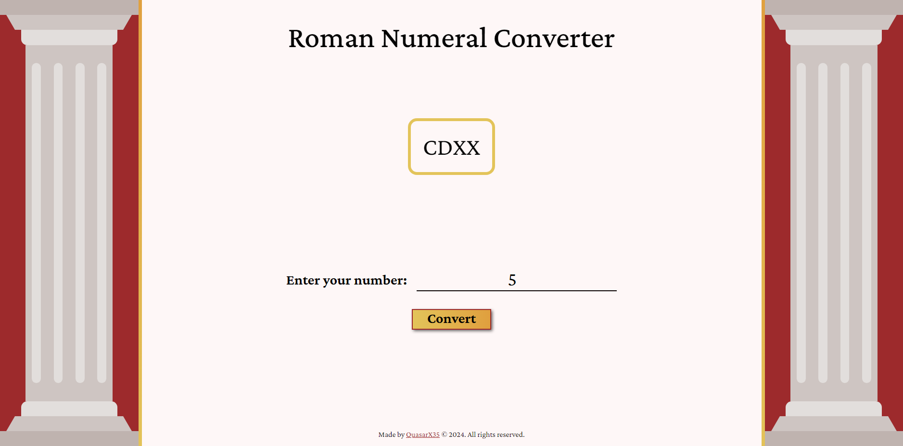
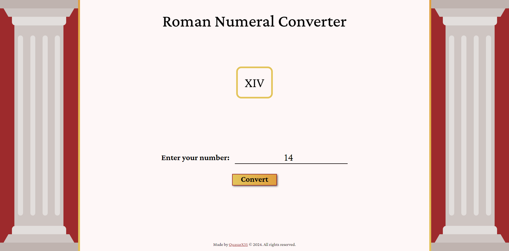
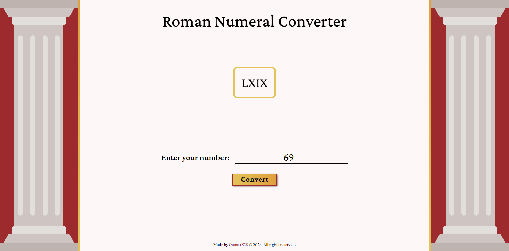
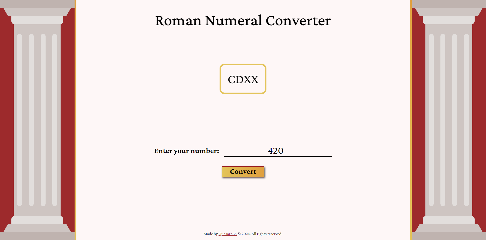
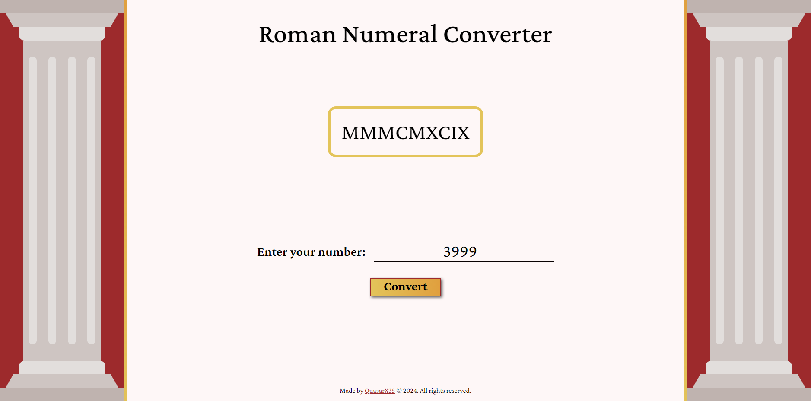
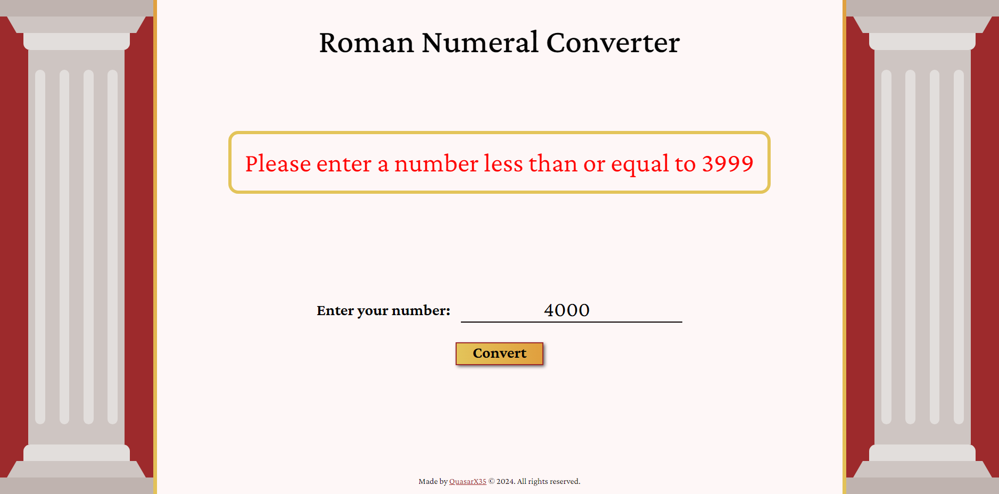
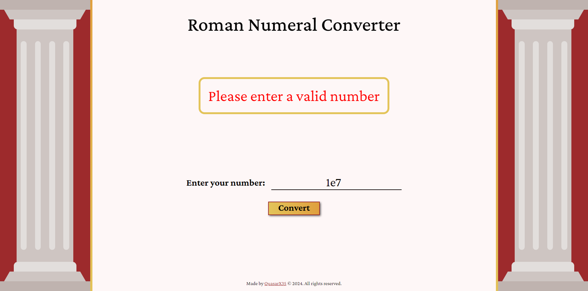
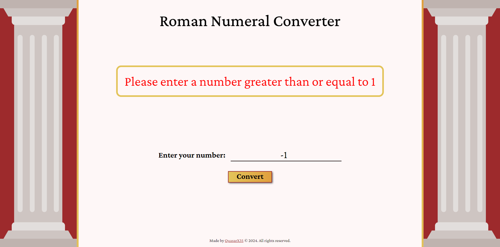

# Roman Numeral Converter
This JavaScript application converts Arabic numerals (numbers we use everyday) to their Roman numeral equivalents. It serves as a certification project for the FreeCodeCamp Javascript Algorithms and Data Structures course.

## Using the Application
- Enter a valid integer in the input field.
- Click the "Convert" button.
- The converted Roman numeral will be displayed below the input field. If an invalid number is entered, an error message will be shown instead.

## Functionality
- Takes an integer as input (between 1 and 3999).
- Converts the input to its corresponding Roman numeral representation.
- Handles edge cases like invalid inputs (negative numbers, numbers exceeding the supported range).
- Displays the converted Roman numeral or an informative error message for invalid inputs.

## Technologies Used
- HTML: for structuring the user interface.
- CSS: for styling the layout and elements.
- JavaScript: for handling user interaction, conversion logic, and error handling.

## Running the Application
- Clone this repository to your local machine.
- Open the index.html file in your web browser.
- Start editing any of the files.

## Screenshots

View the FreeCodeCamp challenge [here](https://www.freecodecamp.org/learn/javascript-algorithms-and-data-structures-v8/build-a-roman-numeral-converter-project/build-a-roman-numeral-converter).